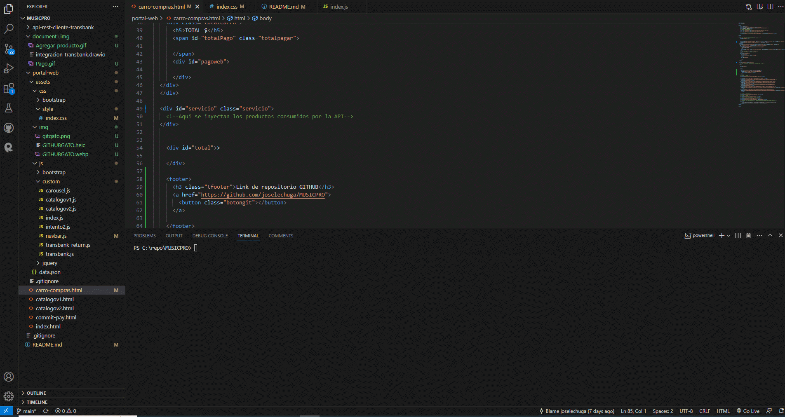
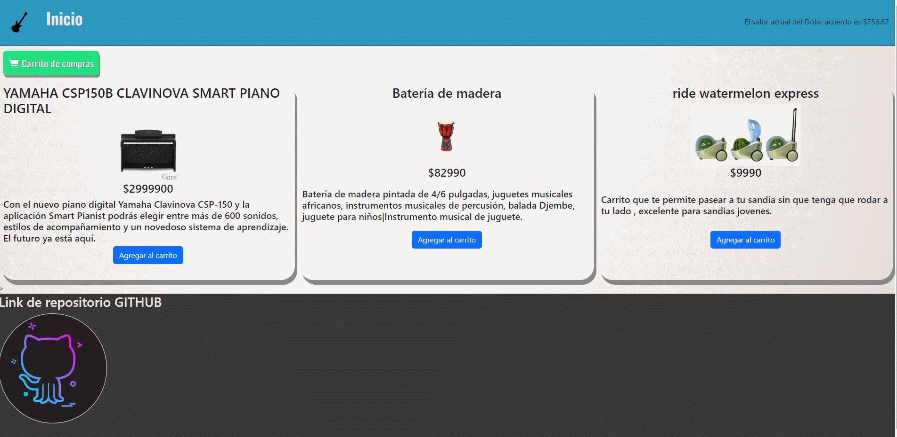
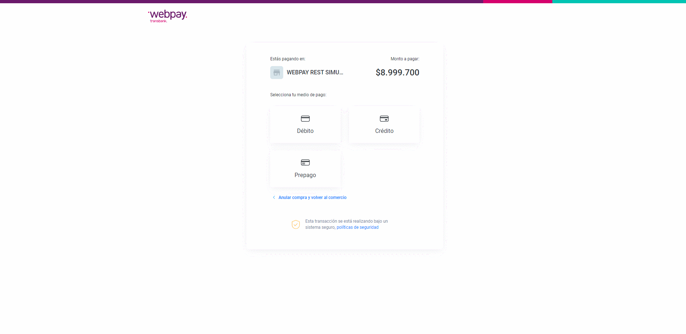

# MUSICPRO

Entrar en carpeta api-rest-cliente-transbank "CD api-rest-cliente-transbank"

# EJECUTAR SERVIDOR

Primero correr servidor manage para API
py manage.py

Luego ejecutar Go live ( Live server )
--------------------------------------------------------------------------


# CARRO DE COMPRAS
'''
Agrega un producto al carro de compras con el boton AGREGAR AL CARRITO y abre el carro,
click en boton PAGAR para acceder a Transbank.
'''


**TARJETA Y CREDENCIALES**
```
REDCOMPRA: 4051 8842 3993 7763

Rut: 11.111.111-1

Clave: 123
```



